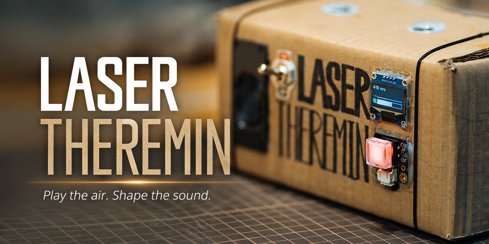
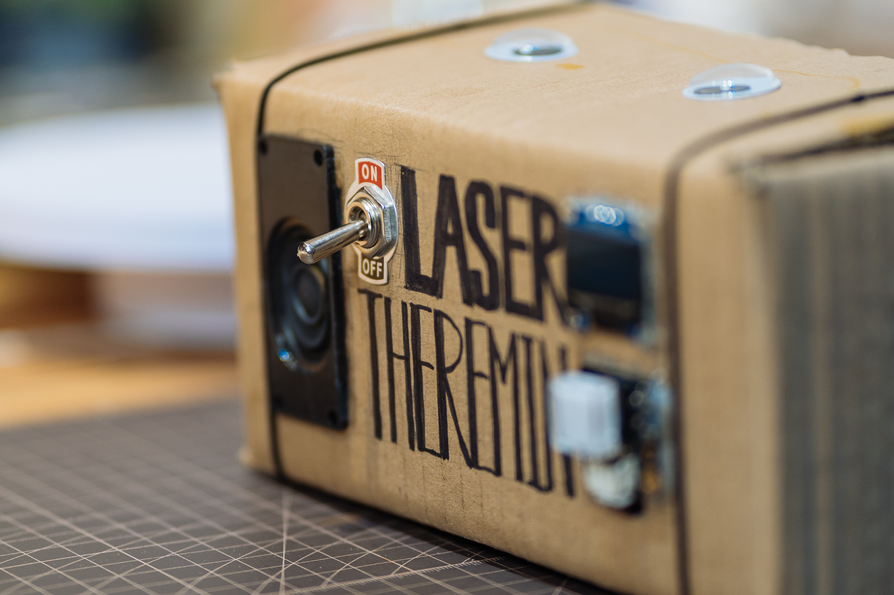
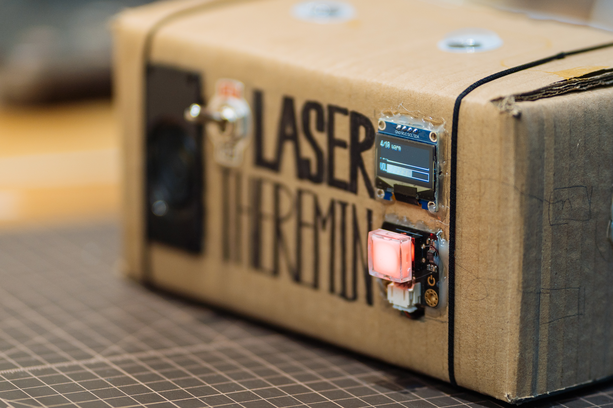

<p align="center">
  
</p>

# 激光特雷门琴 M5

当前阶段目标：

- 主控：`ESP32-S3 DevKitC-1 compatible N16R8`
- 音频：`MAX98357A（已焊接排针） + 3W 扬声器`
- 传感器：`2 x VL53L1X`
- 输出：第 1 个传感器控制 `pitch`，第 2 个传感器控制 `volume`
- 音色：`sine / square / triangle` + `warm / hollow / bright` 内置 wavetable + `sample / sample2` 采样预设 + `example / example2 / example3` 乐谱自动播放预设
- 音高范围：默认 `220Hz - 1760Hz`，共 `3` 个八度
- 状态：已完成本地编译、烧录与双传感器实测，默认低音量输出，已接入串口校准、NVS 持久化和稳态采样校准

完整从硬件到烧录的复现步骤见 [激光特雷门琴复现指南.md](激光特雷门琴复现指南.md)。

## 项目图片

<p align="center">
  
  
  
</p>

## 工程结构

```text
src/
  main.cpp
  app_config.h
  board_profile.h
  audio/
    audio_engine.h
    audio_engine.cpp
  sensors/
    tof_sensor.h
    tof_sensor.cpp
  control/
    calibration_profile.h
    calibration_store.h
    calibration_store.cpp
    generated_scores.h
    hand_mapper.h
    hand_mapper.cpp
    pitch_snapper.h
    pitch_snapper.cpp
    score_player.h
    score_player.cpp
    score_types.h
    smoothing.h
  display/
    oled_status_display.h
    oled_status_display.cpp
  pic/
    banner.png
    1.jpg
    2.jpg
    3.jpg
scores/
  example.abc
  example2.abc
  example3.abc
tools/
  abc_to_score.py
  score_preview.py
  theremin_tool.py
scripts/
  generate_scores.py
```

## 当前 S3 引脚定义

`ESP32-S3 DevKitC-1 compatible N16R8` 当前使用的引脚如下：

- `GPIO4` -> `MAX98357A BCLK`
- `GPIO5` -> `MAX98357A LRC / WS`
- `GPIO6` -> `MAX98357A DIN`
- `GPIO8` -> Pitch `VL53L1X SDA`
- `GPIO9` -> Pitch `VL53L1X SCL`
- `GPIO13` -> Pitch `VL53L1X XSHUT`
- `GPIO11` -> Volume `VL53L1X SDA`
- `GPIO12` -> Volume `VL53L1X SCL`
- `GPIO14` -> Volume `VL53L1X XSHUT`
- `GPIO16` -> `DFRobot DFR0789 LED Switch D`

保留了 `ESP32-C3` 兼容构建；`S3` 迁移说明见 [S3-MIGRATION.md](S3-MIGRATION.md)。

## 接线方法

### ESP32-S3 到 MAX98357A

- `3V3` -> `VIN`
- `GND` -> `GND`
- `GPIO4` -> `BCLK`
- `GPIO5` -> `LRC` / `WS`
- `GPIO6` -> `DIN`
- `3V3` -> `SD`

说明：

- 这块 `S3` 板当前未焊 `IN-OUT`，板上 `5V` 引脚默认不输出，不要依赖它给功放供电
- 当前稳定实测接法是 `3V3 -> VIN`
- `GAIN` 可先悬空
- `SD` 建议直接接到 `3V3`

### 喇叭两根线

- 红线 -> `MAX98357A SPK+`
- 黑线 -> `MAX98357A SPK-`

注意：

- 喇叭两根线都接到功放板的喇叭输出端
- 不要把黑线直接接开发板 `GND`

### Pitch VL53L1X

- `3V3` -> `VIN` / `VCC`
- `GND` -> `GND`
- `GPIO8` -> `SDA`
- `GPIO9` -> `SCL`
- `GPIO13` -> `XSHUT`
- `INT` / `GPIO1` 中断脚可先不接

说明：

- 当前 `M4` 固件已按这组引脚实测通过
- 如果你的模块 6pin 标的是 `GPIO1`、`INT`、`IRQ` 之类，这一脚先悬空即可

### Volume VL53L1X

- `3V3` -> `VIN` / `VCC`
- `GND` -> `GND`
- `GPIO11` -> `SDA`
- `GPIO12` -> `SCL`
- `GPIO14` -> `XSHUT`
- `INT` / `GPIO1` 中断脚可先不接

说明：

- `S3` 上两只传感器走两套独立 I2C
- 两只传感器都已初始化成功

### DFR0789 硬件音色按钮

- `3V3` -> `+`
- `GND` -> `-`
- `GPIO16` -> `D`

说明：

- 当前固件已在 `GPIO16` 接入去抖按钮输入
- 每次按钮状态翻转一次，就切到下一个预设音色
- 当前预设顺序：
  - `1 sine`
  - `2 square`
  - `3 triangle`
  - `4 warm`
  - `5 hollow`
  - `6 bright`
  - `7 sample`
  - `8 sample2`
  - `9 example`
  - `10 example2`
  - `11 example3`
- 串口 `status` 会同步显示 `preset=<n>/11 name=<preset>`

## 编译

```bash
. .venv/bin/activate
pio run
```

说明：

- 每次 `pio run` / `pio upload` 前，都会自动执行 `scripts/generate_scores.py`
- 当前会把 [scores/example.abc](scores/example.abc)、[scores/example2.abc](scores/example2.abc) 和 [scores/example3.abc](scores/example3.abc) 一起转成 [generated_scores.h](src/control/generated_scores.h)
- 同时会生成可直接试听的预览音频：
  - `generated_audio/example.wav`
  - `generated_audio/example2.wav`
  - `generated_audio/example3.wav`
- 如果只想在本机刷新乐谱和试听文件，不编译固件，也可以直接运行：

```bash
python3 scripts/generate_scores.py
```

## 烧录

不同电脑、不同 USB 口、不同固件启动方式下，串口名都可能变化。  
**实际操作时始终先运行 `python3 tools/theremin_tool.py ports`，再把下面命令里的串口替换成你自己看到的那个。**

烧录命令：

```bash
. .venv/bin/activate
pio run -e esp32-s3-devkitc-1 -t upload --upload-port <你的串口>
```

## 串口监视

```bash
. .venv/bin/activate
pio device monitor -b 115200 --port <你的串口>
```

## 串口工具

仓库自带一个不依赖 `pyserial` 的纯标准库串口工具：

```bash
python3 tools/theremin_tool.py ports
python3 tools/theremin_tool.py --port <你的串口> send --quiet-stream status
python3 tools/theremin_tool.py --port <你的串口> smoke-test
python3 tools/theremin_tool.py --port <你的串口> apply-defaults --save
python3 tools/theremin_tool.py --port <你的串口> calibrate --save
```

用途：

- `ports`：列出当前可用串口
- `send`：发送一条或多条串口命令
- `smoke-test`：自动切换 11 个音色/预设并回读 `status`
- `apply-defaults --save`：恢复推荐默认值并保存
- `calibrate --save`：按提示完成 4 步正式校准并保存

正常启动日志应包含：

```text
Laser Theremin M5 boot
Board: ESP32-S3 DevKitC-1 compatible N16R8
Test tone: 440.0 Hz
Pitch I2C ready on SDA=8 SCL=9 XSHUT=13
Volume I2C ready on SDA=11 SCL=12 XSHUT=14
I2S init ok, streaming sine wave.
Pitch VL53L1X init ok at 0x29.
Volume VL53L1X init ok at 0x29.
Waveform default: sine
Audio output default: low volume
```

随后会继续打印当前校准参数和可用命令。`cal ...` 现在会自动连续采集 8 帧并取平均值，避免误把空场距离写进校准参数。

## 串口命令

基础命令：

- `sine`
- `square`
- `triangle`
- `warm`
- `hollow`
- `bright`
- `sample`
- `sample2`
- `example`
- `example2`
- `example3`
- `next`
- `preset <1-11>`
- `mute`
- `unmute`
- `status`
- `stream on`
- `stream off`
- `help`

校准命令：

- `cal pitch near`
- `cal pitch far`
- `cal volume near`
- `cal volume far`
- `set pitch near <mm>`
- `set pitch far <mm>`
- `set volume near <mm>`
- `set volume far <mm>`
- `set smooth pitch <0.01-1.0>`
- `set filter pitch <0.01-1.0>`
- `set smooth volume <0.01-1.0>`
- `set snap smooth <0.01-1.0>`
- `set curve pitch <0.30-2.50>`
- `set snap width <0.05-1.50>`
- `set snap strength <0.00-1.00>`
- `set snap scale <chromatic|major|minor|pmajor|pminor>`
- `set snap root <C..B | 0..11>`
- `snap debug on`
- `snap debug off`
- `set gate volume <0.00-0.80>`
- `set max volume <0.05-0.25>`
- `save`
- `load`
- `defaults`

说明：

- `warm / hollow / bright` 是 3 组内置 `wavetable` 音色
- `sample` 是基于 `src/audio/dream_tides_full_mono10k.wav` 嵌入固件的整首采样预设，产品语义固定为“按 `pitch` 连续变速的可演奏采样音色”
- `sample2` 当前基于一段 `啊` 人声采样转成 `mono / 10kHz / PCM` 后嵌入固件，作为第二个可演奏采样预设
- 当前允许后续频繁替换 `sample` 内容，但默认仍通过重新编译和刷机完成，不考虑 `OTA`
- `example` 当前重新绑定为乐谱自动播放预设，ABC 来源仍是 [scores/example.abc](scores/example.abc)
- `example2` 当前绑定为《天空之城》主旋律预设，ABC 来源是 [scores/example2.abc](scores/example2.abc)，并已整体升高 `1` 个八度
- `example3` 当前绑定为《沸腾的生活》主题旋律预设，ABC 来源是 [scores/example3.abc](scores/example3.abc)
- 当前三首自动播放预设都绑定第 `4` 个音色 `warm`
- `example2` 的离线试听导出文件默认在 `generated_audio/example2.wav`
- `example3` 的离线试听导出文件默认在 `generated_audio/example3.wav`
- 在自动播放预设里，当前控制映射改为：
  - `pitch` 传感器控制播放速度
  - `volume` 传感器继续控制音量
  - 不遮挡 `pitch` 传感器时为默认 `1.00x`
  - 手靠近 `pitch` 传感器时保持较慢
  - 手离远时会逐步加速到 `3.00x`
  - 如果手没有进入 `volume` 检测区，自动播放也会保持静音
- 当前内置 sample 已把素材幅度补偿到接近普通合成音色的量级，靠近 `volume` 传感器时会更容易推到足够高的响度
- `tools/abc_to_score.py` 可把简化子集 `ABC` 转成 [generated_scores.h](src/control/generated_scores.h)
- `tools/score_preview.py` 会按当前固件的波形和滑音/音量平滑参数离线渲染预览 WAV
- `scripts/generate_scores.py` 当前会一次生成 `example`、`example2` 和 `example3` 三首乐谱定义，并同步导出可试听 WAV
- `next` 和 `preset <1-11>` 走的是和硬件按钮同一套预设切换逻辑
- 当前默认音高跨度已经从 `2` 个八度扩到 `3` 个八度：`220Hz - 1760Hz`
- `pitch` 映射现在已进入第一版弧线化：
  - 当前不是单纯“线性手势位置 -> 对数频率”
  - 而是“`power/gamma` 弧线手势位置 -> 对数频率”
  - 默认 `curve=0.75`
  - 当前方向是：离 `pitch` 传感器越近音越低，离远音越高
  - `curve < 1.0` 会扩展远端高音区
  - `curve > 1.0` 会扩展靠近传感器的低音区
- `pitch` 还接入了可保存的软吸附音高控制：
  - 默认支持 `chromatic / major / minor / pmajor / pminor`
  - 默认可调参数包括 `snap width / snap strength / snap smooth / snap root / snap scale`
  - 当前方向是：发音连续，靠近目标调内音时更容易“被轻轻拉住”
- `cal ...` 会进入“保持手势稳定”的采样模式，抓取 8 帧后自动写入平均值
- 如果希望完全手动控制，也可以继续使用 `set ... <mm>`
- `stream off` 可临时关闭自动状态刷屏，`stream on` 可恢复
- `set gate volume` 用来控制“手靠近到多近才开始出声”
- `set max volume` 用来放大或压低演奏最大音量，并且可通过 `save` 持久化
- 如果 `status` 里出现 `score=<name> event=<n>/<total> rest=<yes|no> rate=<x.xx>x`，说明当前预设正处于自动播放模式
- 如果 `status` 里额外出现 `snap scale=... root=... width=... strength=... smooth=...`，说明软吸附参数已经加载
- 自动状态刷屏在 `score` 模式下会显示真实控制关系：
  - `pitch_in ... => rate=...`
  - `out=... Hz`
  - `volume_in ... => ...`

## M5 验收方法

1. 接好 `ESP32-S3 + MAX98357A + 喇叭 + 2 个 VL53L1X`
2. 给板子上电
3. 打开串口监视器看是否打印启动日志
4. 默认会以较低音量输出
5. 改变 pitch 传感器距离时，喇叭音高应明显变化
6. 改变 volume 传感器距离时，音量应明显变化
7. 串口输入 `sine` / `square` / `triangle` / `warm` / `hollow` / `bright` / `sample` / `sample2` / `example` / `example2` / `example3` 应能切换音色或自动播放预设
8. 串口输入 `cal pitch near` 或 `cal volume far` 时，应提示保持手势稳定并在 8 帧后输出平均采样结果
9. 串口输入 `status` 应显示当前音色、静音状态、音高和音量；切到 `example` 时还应显示当前乐谱事件进度

如果无声，先排查：

- `VIN` 和 `GND` 是否接对
- `BCLK / LRC / DIN` 是否接错位
- 喇叭是否接到 `SPK+ / SPK-`
- `SD` 是否需要拉高到 `3V3`
- `VL53L1X` 的 `SDA / SCL` 是否接反
- `XSHUT` 是否没有接好导致传感器未启动
- 如果 volume 一直卡在 `0.02`，说明当前手离得太远或 `volume far` 需要继续校准
- 最新开发进度和明日接续说明见 [session-log.md](session-log.md)
